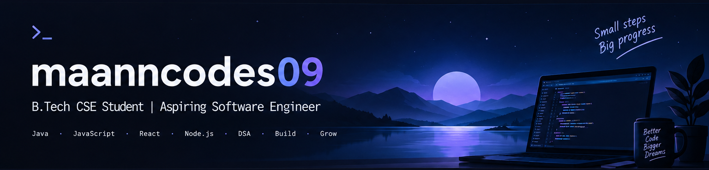

  

## ## Hi, I'm Mansi 👋

### B.Tech CSE Student | Aspiring Software Engineer

Building my foundation in Data Structures, Full-Stack Development, and Backend Engineering.

- 🔭 Currently working on improving my development skills
- 🌱 Learning JavaScript, React, and Backend Development
- 💻 Practicing DSA with Java
- 🚀 Interested in scalable systems and real-world projects

---

## 🛠️ Tech Stack

### Languages
Java • JavaScript • C • SQL

### Frontend
HTML • CSS • React

### Backend
Node.js • Express.js • REST APIs

### Databases & Tools
MongoDB • PostgreSQL • Git • GitHub • Postman

---

## 🚀 Featured Projects

> Projects will be added here as they become ready.

---

## 📈 Current Focus

- Data Structures & Algorithms
- JavaScript & React
- Backend Development
- System Design Fundamentals

---

## 🤝 Connect With Me

[GitHub](https://github.com/maanncodes09) • [LinkedIn](www.linkedin.com/in/mansi-agarwal-316262332)
